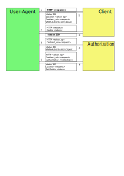

# Authentication with bearer token

*Ouistiti* allows to create an authorization server which responds with a token to use to another ouistiti server.

## build:
To use correctly the *Bearer* authentication the JWT support must be enabled during the *Ouistiti*'s build.

```bash
$ make AUTH=y AUTHN_BEARER=y AUTHZ_JWT=y
```

## "Bearer" authentication:
The *Bearer* authentication is enabled as a *type* of *auth* configuration.
The client must be configurated to use HTTPS (mod_tls must be enabled), otherwise the token
is readable on the network and may be used by hacking.
```config
server = ({
		hostname = "www.ouistiti.local";
		port = 443;
		keepalivetimeout = 5;
		version="HTTP11";
		auth = {
			realm = "ouistiti";
			type = "Bearer";
      options = "token";
		};
		tls = {
			...
		};
	});
```
In a simple case, the *User-Agent* must know the token to send with the request. That may be done:
 * with a *JS* script from HTML file, the script must compute token but it needs to know the HMAC of the token encryption. **This solution is clearly unsafe**.
 * with **trusty *User-Agent* ** containing the secret key. This is the case of the "OpenID" *Client*, like *Ouistiti* in *oAuth2* authentication.
 Another case may be a *Websocket* client like an *Android* application.
 * otherwise an *Authorization* server is mandatory to generate the token.

## "Authorization" server:


### "Client" configuration:
The *Client* needs to redirect the *User-Agent* to the *Token End Point* of the *Authorization* server. The *End Point* is defined
with the *token_ep* of the configuration file.

The *Client* server will add the "redirect_uri" query to allow the "Authorization" server to redirect back to the "Client" server.

As the *User-Agent* doesn't accept to forward the *Authorization* header from a server, the *Client* must accept the token from the cookie.
If the *Client* and the *Authorization* servers are not on the same machine, they must be at least in the same domain.
*Ouistiti* add the *Domain* management on the *Set-Cookie* header to share information between servers.

The *Client* needs to authenticate the token from the *Authorization* server. They must share the same "secret" to compute the HMAC of the token.

```config
server = ({
		hostname = "www.ouistiti.local";
		port = 443;
		keepalivetimeout = 5;
		version="HTTP11";
		auth = {
			realm = "ouistiti";
			type = "Bearer";
			options="token,cookie";
			token_ep = "https://auth.ouistiti.local:8443/redirect";
			secret="ffacaa18-593b-4842-ad0d-04a6e6886be1";
		};
		tls = {
			...
		};
	});
```

### "Authorization" configuration:
The *Authorization* manages the authentication with *Basic* or *Digest* authentication, or with login page.

The best way to store the credentials and to manage them, is the database.

```config
server = ({
		hostname = "auth.ouistiti.local";
		port = 8443;
		keepalivetimeout = 5;
		version="HTTP11";
		auth = {
			realm = "ouistiti";
			dbname = "/tmp/openid.db";
			type = "Basic";
			unprotect="^trust/*";
			expire = 3600;
			options = "token,cookie";
			secret="ffacaa18-593b-4842-ad0d-04a6e6886be1";
		};
	});
```

The redirection from the *Auth* to the *Client* must be done by a *JS* script or directly
with the *Ouistiti* configuration.
```config
server = ({
		hostname = "auth.ouistiti.local";
		port = 8443;
		keepalivetimeout = 5;
		version="HTTP11";
		redirect = {
			links =  ({
				origin = "^redirect*";
				options = "temporary";
			});
		};
	});
```

The *Auth* server generates a token in JWT format which contains the user information and
encrypted with the same HMAC as the *Client* and push it to the *User-Agent* inside a *Cookie*.

To share the same domain with the *Client* and the *Authorization* servers, their *hostname* configuration must contain the same *domain*.
```config
server = ({
		hostname = "auth.ouistiti.local";
	});
```
```config
server = ({
		hostname = "www.ouistiti.local";
	});
```
And the *User-Agent* must use this *URL* and not *IP* address. To do that the DNS or the
*/etc/hosts* file of the *User-Agent* must translate correctly the *URL*.
